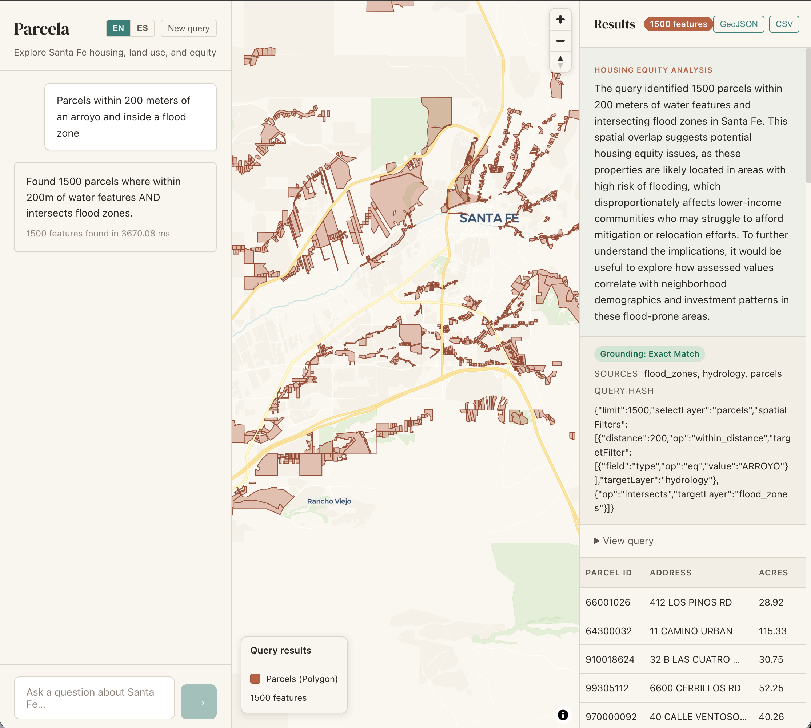

# Parcela

*Read this in [Español](README.es.md).*

**Natural-language spatial analysis for Santa Fe housing, land use, and equity.**

Parcela lets users ask questions like *"Show me residential parcels within 500 meters of transit"* and inspect the results on a MapLibre map with a transparent structured query, exported GeoJSON/CSV, and an equity-aware explanation.



Current status: late prototype / review build. The API, web app, Docker build, data pipeline, and tests are working locally. A public production deployment is still pending.

---

## What Works Now

- Natural-language query parsing in English and Spanish
- Server-owned multi-turn conversations via `conversationId`
- Constrained `StructuredQuery` validation with Zod and registry grounding
- Spatial operations for distance, intersects, contains, within, and nearest
- DuckDB spatial execution over local Parquet data
- Dual geometry columns: `geom_4326` for display/topology and `geom_utm13` for metric operations
- React 19 frontend with MapLibre, Zustand, localized UI, result tables, choropleth support, and GeoJSON/CSV export
- LLM provider abstraction for local Ollama and production Together.ai
- Production guards for concrete CORS origin and API key when `NODE_ENV=production`
- Request IDs, structured logging, rate limits, graceful shutdown, and Docker build support

## Data Snapshot

The checked-in manifest currently describes 14 layers and 109,417 features under `api/data`.

| Layer | Features | Geometry |
|-------|----------|----------|
| `parcels` | 63,439 | Polygon |
| `building_footprints` | 42,630 | Polygon |
| `zoning_districts` | 851 | Polygon |
| `short_term_rentals` | 897 | Point |
| `bikeways` | 536 | LineString |
| `transit_access` | 447 | Point |
| `flood_zones` | 227 | Polygon |
| `hydrology` | 109 | LineString |
| `neighborhoods` | 106 | Polygon |
| `parks` | 77 | Polygon |
| `census_tracts` | 57 | Polygon |
| `affordable_housing_units` | 35 | Polygon / Point |
| `historic_districts` | 5 | Polygon |
| `city_limits` | 1 | Polygon |

See [docs/DATA_SOURCES.md](docs/DATA_SOURCES.md) and [docs/DATA_CATALOG.md](docs/DATA_CATALOG.md) for provenance and data notes.

## Architecture

```text
User message
  -> /api/chat
  -> intent grounding
  -> LLM parse to StructuredQuery
  -> Zod + layer registry validation
  -> query normalization and caps
  -> DuckDB spatial SQL
  -> GeoJSON result + explanation
  -> React/MapLibre rendering
```

Every response includes the structured query and result metadata so users can see what the system actually ran.

## Tech Stack

| Area | Technology |
|------|------------|
| Web | React 19, TypeScript, Vite, MapLibre GL JS, Zustand, i18next |
| API | Hono, TypeScript, Zod |
| Spatial engine | DuckDB with spatial extension |
| LLM | Ollama for local development, Together.ai for hosted use |
| Tests | Vitest |
| Deployment target | Dockerized API, static web build |

## Local Development

Prerequisites:

- Node.js 20+
- Ollama, if you want local natural-language parsing without a Together.ai key
- Git

Install dependencies:

```bash
npm --prefix api install
npm --prefix web install
```

Optional local LLM:

```bash
ollama pull qwen2.5:7b
```

Start the API and web app in separate terminals:

```bash
npm --prefix api run dev
npm --prefix web run dev
```

Defaults:

- API: `http://localhost:3000`
- Web: `http://localhost:5173`
- Web API override: set `VITE_API_BASE=http://localhost:<api-port>` in `web/.env`

The API will try the next available port when `PORT` is unset and `3000` is already in use.

## Environment

API variables are documented in [api/.env.example](api/.env.example).

| Variable | Default | Notes |
|----------|---------|-------|
| `PORT` | `3000` | API listen port; auto-increments in dev when unset |
| `CORS_ORIGIN` | `*` in dev | Required concrete origin in production |
| `API_KEY` | unset in dev | Required in production; accepted via `X-API-Key` or bearer token |
| `TOGETHER_API_KEY` | unset | Enables Together.ai instead of Ollama |
| `TOGETHER_MODEL` | `Qwen/Qwen2.5-7B-Instruct` | Hosted model |
| `OLLAMA_BASE_URL` | `http://localhost:11434` | Local Ollama endpoint |
| `OLLAMA_MODEL` | `qwen2.5:7b` | Local model |
| `TRUSTED_PROXY_COUNT` | `0` | Controls forwarded-IP trust for rate limiting/logging |

## Validation

Current local verification:

```bash
npm --prefix api run typecheck
npm --prefix api test -- --run
npm --prefix web run typecheck
npm --prefix web test -- --run
npm --prefix shared run typecheck
npm run lint
npm --prefix web run build
```

Latest run: 95 API tests, 37 web tests, shared typecheck, lint, and web production build passed.

## API

| Endpoint | Method | Description |
|----------|--------|-------------|
| `/api/health` | GET | Service health check |
| `/api/layers` | GET | Loaded layers and schemas |
| `/api/query` | POST | Direct structured query |
| `/api/chat` | POST | Natural-language query to results |
| `/api/templates` | GET | Runnable equity-analysis query templates |
| `/api/templates/:id` | GET | Template details |
| `/api/templates/category/:category` | GET | Templates by category |

Example chat request:

```bash
curl -X POST http://localhost:3000/api/chat \
  -H "Content-Type: application/json" \
  -d '{"message":"Show residential parcels near transit","lang":"en"}'
```

The response includes `conversationId`, `conversationTurn`, `query`, `result`, `summary`, `explanation`, optional `equityNarrative`, `confidence`, `grounding`, and `metadata`.

For direct queries, use the wrapped request shape:

```json
{
  "query": {
    "selectLayer": "parcels",
    "spatialFilters": [
      {
        "op": "within_distance",
        "targetLayer": "transit_access",
        "distance": 500
      }
    ],
    "limit": 100
  }
}
```

## Docker

Build and run the API image:

```bash
docker build -t parcela .
docker run --rm -p 3000:3000 \
  -v "$(pwd)/api/data:/app/api/data" \
  parcela
```

Production deployments must provide a concrete CORS origin and API key:

```bash
docker run --rm -p 3000:3000 \
  -v "$(pwd)/api/data:/app/api/data" \
  -e NODE_ENV=production \
  -e CORS_ORIGIN=https://your-frontend.example \
  -e API_KEY=replace-with-secret \
  -e TOGETHER_API_KEY=your-key \
  parcela
```

## Repository Layout

```text
parcela/
├── api/          # Hono API, DuckDB integration, orchestrator, tests, data manifest
├── web/          # React/Vite frontend, MapLibre views, frontend tests
├── shared/       # Shared API/query/geo types and field labels
├── scripts/      # Data acquisition and preparation scripts
├── docs/         # Architecture, data, status, and historical planning docs
└── .github/      # CI workflow
```

## Documentation

- [docs/README.md](docs/README.md) — Documentation map and freshness notes
- [docs/ARCHITECTURE.md](docs/ARCHITECTURE.md) — Technical design
- [docs/PROJECT_STATUS.md](docs/PROJECT_STATUS.md) — Current review snapshot
- [docs/DATA_CATALOG.md](docs/DATA_CATALOG.md) — Current loaded layer catalog
- [docs/DATA_SOURCES.md](docs/DATA_SOURCES.md) — Data provenance and licensing
- [docs/BUILD_PLAN.md](docs/BUILD_PLAN.md) — Historical build plan and remaining product work

## Known Gaps

- No public production deployment is documented yet.
- School zones, wildfire risk, vacancy, and eviction layers are not loaded.
- API key validation is intentionally simple and should be replaced with rotated key management before public launch.
- Data refresh cadence is not automated.
- Spanish README and some historical planning docs lag the English/current-state docs.

## License

MIT License. See [LICENSE](LICENSE).
